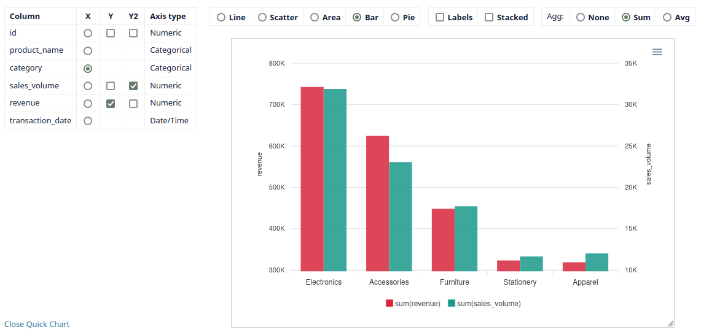
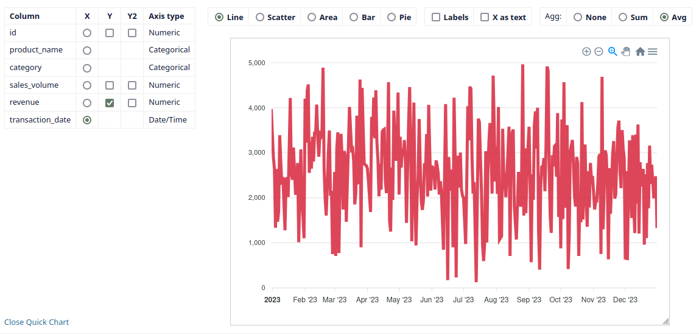
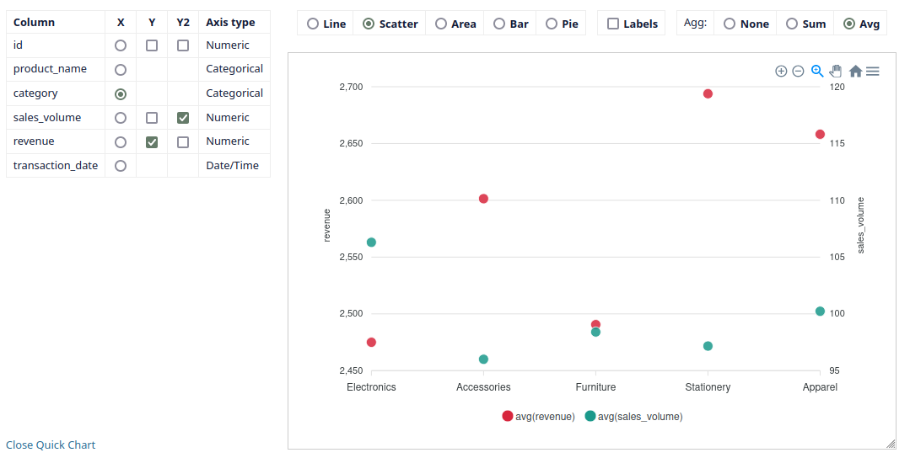
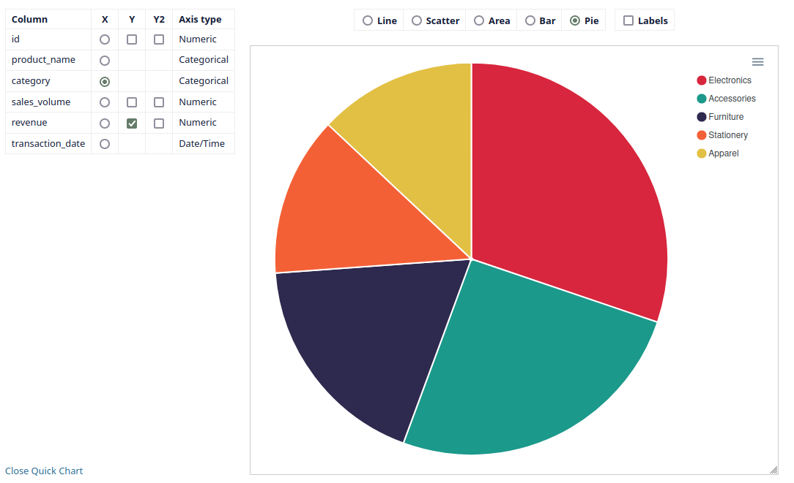

# datasette-quickchart
Datasette plugin for making quick charts from tables and SQL queries using Apex Charts. It only takes 2 clicks to make a first chart.

## Installation

The plugin is single-file and 100% JS, so no installation via PyPI packages is required. Just add a link to your Datasette configuration:

- if you use YAML format:
```yaml
extra_js_urls:
- https://cdn.jsdelivr.net/gh/commongeek/datasette-quickchart@latest/quickchart.js
```

- if you use JSON format:
```json
  "extra_js_urls": [
    "https://cdn.jsdelivr.net/gh/commongeek/datasette-quickchart@latest/quickchart.js"
  ]
```
The plugin will then add itself to every Datasette table and query view.
If you want to host locally you need to copy the quickchart.js file to your static directory and modify the URL accordingly.

## Configuration

Currently, the only configurable option is to choose the color palette used by the charts (compatible with https://apexcharts.com/docs/options/theme/). The default is palette7 because it seems to me to be the most consistent with the Datasette color scheme.

You can set the palette number by adding an argument to the script URL, e.g.
```bash
https://cdn.jsdelivr.net/gh/commongeek/datasette-quickchart@latest/quickchart.js?palette=1
```

## Features

| Feature | Status | Description |
| --- | --- | --- |
| Many types of charts | + | Line, scatter, area, bar, stacked bar and pie.  |
| Works in both table and query wievs | + ||
| Fast | + | Data is loaded only once. |
| Keeps settings | + | With the current settings saved in sessionStorage, the chart persists across actions like sorting, moving to the next page of results, and so on. |
| Interactive | + | The chart supports zooming, scrolling, and other interactions. |
| Export | + | The chart supports exporting to PNG or SVG formats. |
| Aggregation | + | Data can be aggregated as a sum or an average. More advanced aggregations are possible through appropriate SQL queries or views. |
| Considers all data | + | The chart shows all data up to max_returned_rows Datasette setting, not just the data visible on the current results page. |
| Recognition of data types | + | The plugin analyzes all data in each column and assigns it one of the following types: numeric, categorical, date/time or null (if all values in the column are null). Timestamps are interpreted as numbers. I don’t know how to change that yet. |

## Screenshots





